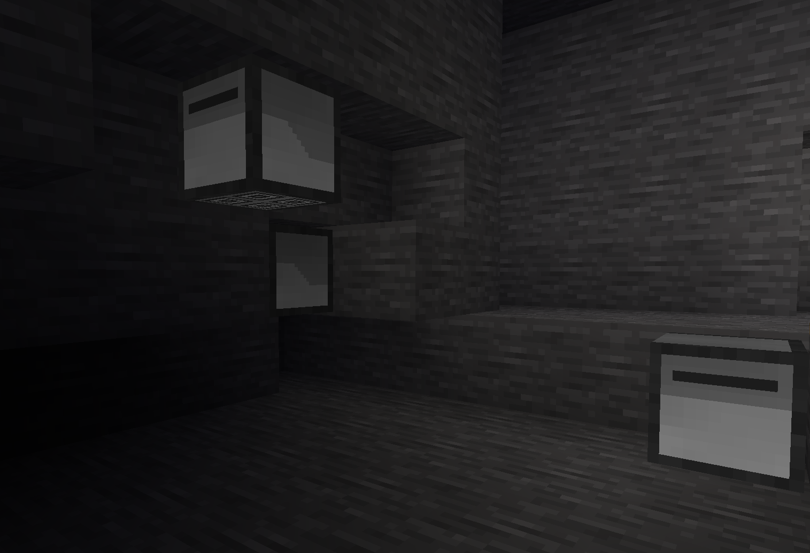

# Computertest

A ComputerCraft-inspired mod for Minetest!

## Working Features

- LUA can be uploaded and ran on a turtle (see [/examples]())
- Actions like mining, moving and turning the turtle
- Turtles take time to do actions such as moving,mining,turning,etc

## Security Problems

- The turtle code isn't sandboxed, so turtles could call dangerous functions (Add sandboxing)
- Anyone can upload code (Add code-uploading privilege)

## Features to Add

- Add dumping into chests to create fully-auto mining
- Add fuel, so everything consumes fuel until it runs out or refuels
- Inventory management commands, such as crafting, sorting, and dropping

Anyone interested in adding these features can try in entity/turtle.lua, I'd be interested in any great working pull requests!
